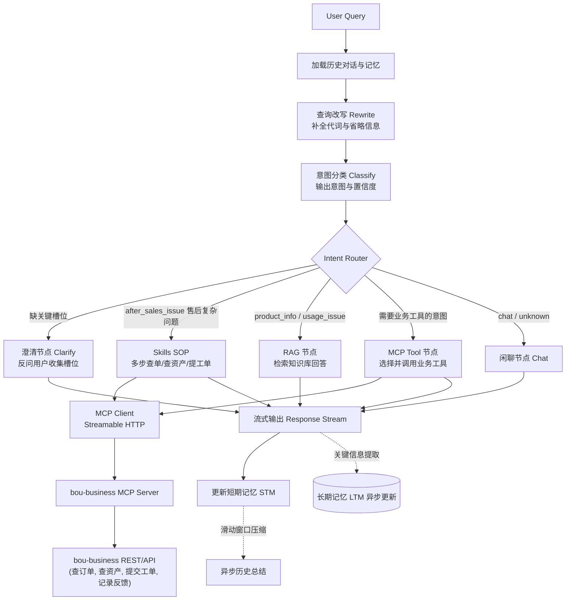

# AI Customer Service — BOU 智能客服

基于 LangGraph + RAG 的企业级 AI 客服系统，支持意图识别、长短期记忆管理、RAG 知识库检索、MCP 工具调用、复杂 SOP 执行及流式回复。

## 技术栈

| 层 | 技术 |
|---|---|
| 前端 | Vue3 + TailwindCSS + Pinia |
| 后端 | Python 3.11+ · FastAPI · SSE 流式输出 |
| Agent | LangGraph (StateGraph) |
| LLM | OpenAI 兼容接口（可切换任意模型） |
| 向量库 | Qdrant（外部独立服务，可选） |
| 数据存储 | MongoDB（持久化对话历史、长期记忆） |
| 业务系统 | bou-business（独立 Node 服务，REST API + MCP Server） |

## Agent 核心架构与流程

本项目采用模块化的多 Agent 节点设计，核心流程如下：



### 关键设计点 (Agent Design)

1. **查询预处理 (Query Preprocessing)**
   - **Rewrite (查询改写)**: 结合最近的历史记录，将用户的简写或代词（如“那我有什么权益”）补全为独立的查询语句（如“月卡VIP用户有哪些权益？”），提高后续意图识别和检索的准确率。
   - **Classify (意图分类)**: 使用 LLM 结构化输出（Structured Output），将用户问题分为售后、吐槽、产品咨询、闲聊、实时信息等，并给出置信度。

2. **工具型意图与 MCP**
   - 需要业务工具的意图路由到 `mcp_tool` 节点。
   - `mcp_tool` 节点先用 selector 选择 MCP tool 和参数，再用 executor 通过 `app.mcp.client` 调用独立业务系统 `bou-business` 暴露的 MCP tools。
   - selector 可以使用 LLM 理解用户问题和工具 schema；executor 不使用 LLM，只负责协议调用、结果解析和状态更新。
   - Agent 后端是 MCP Host + MCP Client；`bou-business` 是 MCP Server + 业务 API 边界。

3. **Skills / SOP**
   - `skills_node` 用于复杂业务意图，不是 MCP tool，也不是接口。
   - Skill 是沉淀下来的 SOP：检查槽位 → 标准化字段 → 查订单 → 查资产 → 提工单 → 生成回复。
   - Skill 执行过程中可以调用 MCP tools，但 skill 本身仍属于 Agent 内部业务流程。

4. **长短期记忆管理 (Memory Management)**
   - **短期记忆 (STM)**：使用 MongoDB 存储会话级消息记录。当对话轮数超过阈值（如 6 轮）时，后台触发**异步压缩任务**，调用 LLM 将旧消息总结成简短摘要，并拼接在上下文头部，有效控制 Token 消耗并保留上下文。
   - **长期记忆 (LTM)**：预留异步更新脚手架，在特定节点或对话结束时，将 `dialog_state` 收集到的用户偏好或关键 Fact 提取出来，准备存入向量数据库或用户画像系统，实现跨 Session 的记忆。

5. **提示词随节点管理 (Prompt Management)**
   - 各节点使用的提示词直接在对应节点文件中声明为变量并引用，便于阅读节点逻辑时同时看到完整 prompt。

## 快速启动

### 本地开发：一键启动全套 Docker 环境

推荐本地开发统一使用 Docker，不要再混合手动启动多个前后端进程：

```bash
make dev-up
make dev-check
```

访问地址：

- 客服前端：http://127.0.0.1:5173/chat
- 客服后端：http://127.0.0.1:8000/health
- 管理后台前端：http://127.0.0.1:5174/admin
- 管理后台后端：http://127.0.0.1:8001/health
- 业务 MCP：http://127.0.0.1:8011/health

常用命令：

```bash
make dev-ps       # 查看服务状态
make dev-logs     # 查看所有服务日志
make dev-restart  # 重启所有服务
make dev-down     # 停止全套服务
```

### 1. 后端（可选：只在不使用 Docker 时手动启动）

**Python 需要 3.11 或以上版本。**

```bash
cd backend
python3 -m venv venv && source venv/bin/activate
pip install -r requirements.txt

cp .env.example .env
# 编辑 .env，至少填写 LLM_MODEL / LLM_API_KEY / LLM_BASE_URL
# 对话历史依赖 MongoDB：可先执行下方 docker compose 启动 Mongo，或自备实例并配置 MONGODB_URL

uvicorn main:app --reload --port 8000
```

### 2. 前端

```bash
cd frontend
npm install
npm run dev
```

打开 http://localhost:5173

### 3. 基础设施（旧方式，不推荐）

```bash
docker compose -f docker-compose.dev.yml up -d   # bou-business (8011) + Qdrant (6333) + MongoDB (27017)
```

现在 `docker-compose.dev.yml` 会启动完整本地开发环境。旧的“只起基础设施、前后端手动跑”方式容易造成端口和进程混乱，不建议继续使用。

`.env` 中配置 `MONGODB_URL=mongodb://localhost:27017`、`MCP_SERVER_URL=http://localhost:8011/mcp`（与手动方式一致）。  
知识库由外部服务写入 Qdrant，本项目只负责检索。

---

## 服务器部署（生产环境）

### 1. 购买云服务器

推荐规格：**2 核 4 GB 内存**（阿里云 / 腾讯云 / 火山引擎轻量应用服务器，约 ¥60-100/月）  
系统：Ubuntu 22.04 LTS

### 2. 服务器初始化

```bash
# 安装 Docker
curl -fsSL https://get.docker.com | sh
sudo usermod -aG docker $USER
newgrp docker

# 安装 Docker Compose plugin（通常随 Docker 一起安装，验证一下）
docker compose version
```

### 3. 拉取代码 & 配置环境变量

```bash
git clone https://github.com/你的账号/ai-customer.git
cd ai-customer

cp backend/.env.example backend/.env
# 编辑 .env，填写 API Key、模型名等
vi backend/.env
```

关键配置项（生产环境）：

```bash
LLM_MODEL=doubao-seed-1-8-251228
LLM_API_KEY=your-key
LLM_BASE_URL=https://ark.cn-beijing.volces.com/api/v3

EMBEDDING_MODEL=doubao-embedding-vision-251215
EMBEDDING_BASE_URL=https://ark.cn-beijing.volces.com/api/v3/embeddings/multimodal

# 以下由 docker-compose.yml 自动覆盖，保持默认即可
QDRANT_URL=http://qdrant:6333
MONGODB_URL=mongodb://mongodb:27017
MCP_SERVER_URL=http://bou-business:8011/mcp
```

如果你想直接调用火山引擎托管知识库，而不是本地 Qdrant，可在 `backend/.env` 中额外配置：

```bash
RAG_PROVIDER=volcengine_kb
VOLC_KB_AK=your-ak
VOLC_KB_SK=your-sk
VOLC_KB_COLLECTION_NAME=你的知识库名称

# 可选
VOLC_KB_ACCOUNT_ID=
VOLC_KB_PROJECT=default
VOLC_KB_HOST=api-knowledgebase.mlp.cn-beijing.volces.com
VOLC_KB_REGION=cn-north-1
VOLC_KB_SERVICE=air
```

此时后端会直接调用火山引擎知识库检索接口，保留现有 RAG 生成链路；`Qdrant` 配置可继续保留作为本地方案。

### 4. 启动全栈服务

```bash
docker compose up -d --build
```

首次会拉取镜像并构建，约需 3-5 分钟。启动后通过服务器 IP 访问：`http://<服务器IP>`

查看服务状态：

```bash
docker compose ps
docker compose logs -f backend   # 实时查看后端日志
```

### 5. 导入知识库（可选）

知识库数据需要在服务器上单独运行一次导入脚本：

```bash
# 将 PDF 文件上传到服务器 data/ 目录后执行
cd scripts
pip install -r requirements.txt
python ingest_pdf.py ../data/你的文档.pdf
```

### 6. 绑定域名（可选）

如果有域名，解析 A 记录到服务器 IP，再配置 SSL 证书（推荐使用 Certbot + Let's Encrypt）：

```bash
sudo apt install certbot python3-certbot-nginx
sudo certbot --nginx -d your-domain.com
```

## 切换 LLM 模型

修改 `backend/.env` 即可，无需改代码：

```bash
# 火山引擎·豆包
LLM_MODEL=doubao-seed-1-8-251228
LLM_API_KEY=your-key
LLM_BASE_URL=https://ark.cn-beijing.volces.com/api/v3

# DeepSeek
LLM_MODEL=deepseek-chat
LLM_API_KEY=your-key
LLM_BASE_URL=https://api.deepseek.com

# 通义千问
LLM_MODEL=qwen-max
LLM_API_KEY=your-key
LLM_BASE_URL=https://dashscope.aliyuncs.com/compatible-mode/v1

# OpenAI
LLM_MODEL=gpt-4o
LLM_API_KEY=sk-xxx
LLM_BASE_URL=   # 留空

# 本地 Ollama
LLM_MODEL=qwen2.5:7b
LLM_API_KEY=ollama
LLM_BASE_URL=http://localhost:11434/v1
```

## API 接口

| 方法 | 路径 | 说明 |
|---|---|---|
| POST | `/api/chat/stream` | SSE 流式对话 |
| GET | `/api/chat/history?session_id=xxx&user_id=xxx` | 获取对话历史（须与创建会话时 user_id 一致） |
| DELETE | `/api/chat/history?session_id=xxx&user_id=xxx` | 清空对话历史 |
| GET | `/health` | 健康检查 |

## 项目结构

```
backend/
├── app/
│   ├── agent/
│   │   ├── graph.py          # LangGraph 图定义及条件路由
│   │   ├── state.py          # 对话状态 (包含 messages, intent, dialog_state 等)
│   │   ├── memory.py         # 长短期记忆 (STM压缩, LTM脚手架)
│   │   └── nodes/
│   │       ├── rewrite.py    # 查询改写节点
│   │       ├── classify.py   # 意图分类节点
│   │       ├── rag_node.py   # RAG 检索节点
│   │       ├── mcp_tool_node.py # MCP 工具选择、执行和回复节点
│   │       ├── skills_node.py # 复杂 SOP 执行节点
│   │       ├── chat_node.py  # 闲聊 / 澄清节点
│   │       └── web_search_node.py # 预留联网查询节点
│   ├── mcp/client.py         # MCP Client (Streamable HTTP JSON-RPC)
│   ├── api/chat.py           # FastAPI 路由（SSE, 接收 LangGraph stream）
│   ├── rag/retriever.py      # Qdrant 检索
│   ├── db/mongo.py           # MongoDB 读写 (对话记录持久化)
│   ├── llm.py                # LLM 工厂
│   └── config.py             # 全局配置
bou-business/
├── src/server.js             # 独立业务系统：REST API + MCP Server
├── src/business.js           # 业务能力和幂等逻辑
└── src/data.js               # 测试业务数据
frontend/
├── src/
│   ├── views/ChatView.vue    # 主页面
│   ├── components/MessageBubble.vue
│   └── stores/chat.js        # 状态管理 + SSE 对接
docker-compose.yml            # 生产全栈（nginx + backend + bou-business + qdrant + mongodb）
docker-compose.dev.yml        # 本地开发（bou-business + qdrant + mongodb）
```
